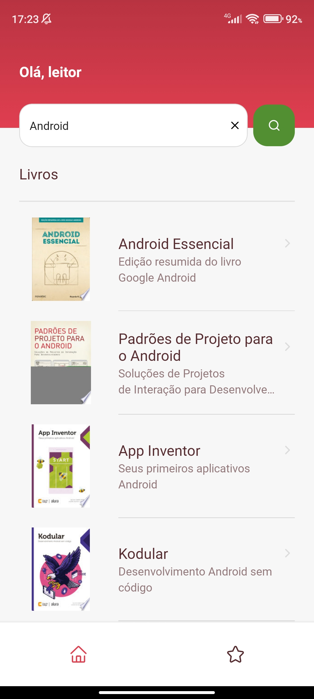
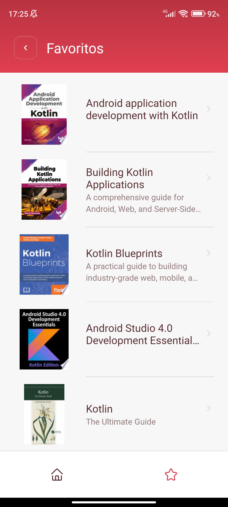

<h1 align="center">
  GoBooks
</h1>

<p align="center" style="margin-right: 8px">
  
  
  
</p>

## 💻 Sobre o projeto

Uma aplicação que lista livros da API do Google Books através de uma pesquisa rápida, utilizando gratuitamente a API disponibilizada pelo Google Books.

## ⚙️ Funcionalidades

- Pesquisa por livros
- Listagem dos livros encontrados além de você poder consultar detalhes de cada livro(autor, descrição, preço)
- Favoritar livros

## 🛠 Tecnologias

- React native com Expo
- Typescript
- Styled Components
- Async Storage
- Axios
- React Navigation
- Testes unitários

## 🚀 Como executar o projeto

Assim que você der um clone no projeto, é necessário instalar as dependências da aplicação. Para isso, acesse o diretório da aplicação e execute o comando:

```bash
npm install
```

Depois disso, dentro da raiz do projeto execute o expo:

```bash
npx expo start
```

Feito isso, tudo deve estar rodando normalmente 🚀
